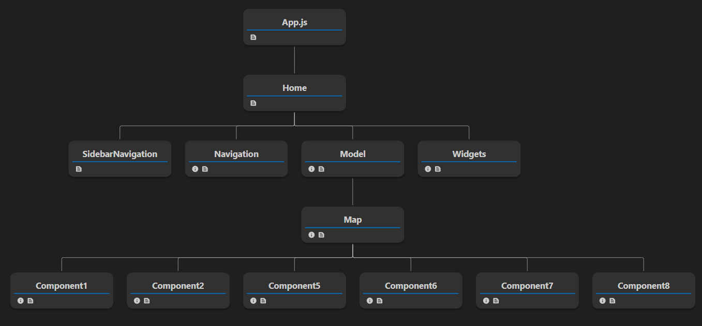

# Widget Management Application Documentation

## Introduction

The Widget Management Application is a web-based tool designed to manage and visualize data using customizable widgets. Users can add, customize, and delete widgets to create personalized dashboards for data analysis. The application is built using React.js and utilizes various packages for UI components and data visualization.

## Features

1. **Widget Management**: Users can add, customize, and delete widgets to create personalized dashboards.
2. **Customization Options**: Each widget can be customized with different colors and styles to represent data effectively.
3. **Data Visualization**: The application provides various types of charts and components for data visualization, including line charts, pie charts, and bar graphs.
4. **User-Friendly Interface**: The interface is designed to be intuitive, allowing users to easily navigate, add, and manage widgets.

## Note

1. **Work in progress** - Have to work on mobile view interface.
2. **To adjest the model screen** while adding widgets, you can double click on that widget and loose grip then you can move your cursor then screen will move.
3. **Widget screen is responsive**, you can move the position of widgets by drag and drop. 

## Components

### 1. Sidebar and Navigation

- **Description**: The sidebar and navigation bar provide access to different sections of the application, including adding new widgets and managing existing ones. (For now it doesn't contains the functionality. Just to show.)
- **Functionality**: Users can navigate between different sections and access widget management features.

### 2. Widgets

- **Description**: Widgets are components that display data in various formats, such as charts, graphs, and text blocks.
- **Functionality**: Users can add, customize, and delete widgets to visualize different data sets.

### 3. Model Component

- **Description**: The Model component is a modal dialog that appears when users want to add a new widget.
- **Functionality**: Users can select the type of widget (e.g., line chart, pie chart) and customize its appearance (e.g., colors, labels) before adding it to the dashboard.

### 4. Delete Button

- **Description**: Each widget includes a delete button for removing the widget from the dashboard.
- **Functionality**: Clicking the delete button removes the corresponding widget from the dashboard.

## Packages Used

- **apexcharts**: Interactive JavaScript charts library
- **react-apexcharts**: React wrapper for ApexCharts
- **draggabilly**: JavaScript library for draggable UI elements
- **react-draggable**: React component for draggable elements
- **packery**: JavaScript layout library for draggable grid layouts
- **react-flow-renderer**: React component for rendering flowcharts and diagrams
- **react-zoom-pan-pinch**: React component for zooming, panning, and pinching images and elements
  
## Json Data

- Color coding data is coming from JsonData.json file

## Usage

To use the Widget Management Application, follow these steps:

1. Navigate to the homepage of the application.
2. To add a new widget, click on the "Add Widget" button in the navigation bar.
3. Customize the widget using the Model component, selecting the type and appearance.
4. Click "Save" to add the widget to the dashboard.
5. To delete a widget, use the delete button located on each widget.

## Component Structure

## Conclusion

The Widget Management Application provides a user-friendly interface for managing and visualizing data through customizable widgets. With its intuitive design and rich features, users can create dynamic dashboards for data analysis and decision-making. 
